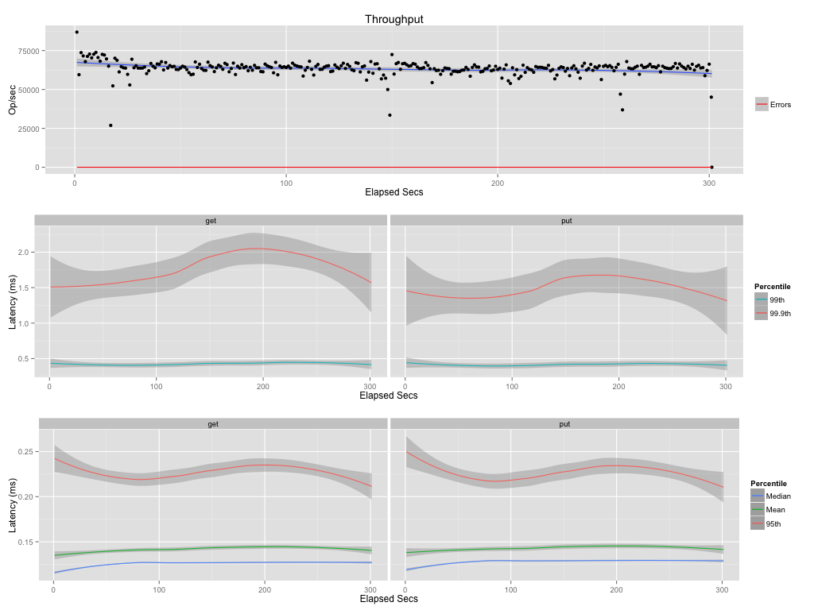
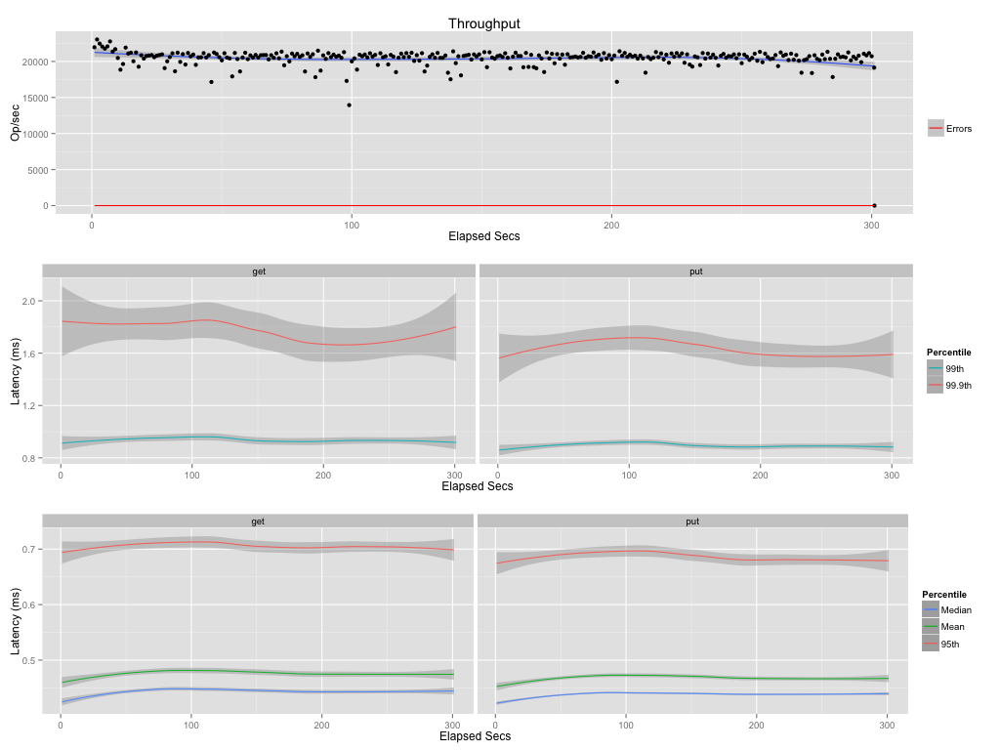

# Segmented in-memory cache

Cache uses N disposable ETS tables instead of single one. The cache applies eviction and quota
policies at segment level. The oldest ETS table is destroyed and new one is created when 
quota or TTL criteria are exceeded.   

The write operation always uses youngest segment. The read operation lookup key from youngest to oldest table until it is found same time key is moved to youngest segment to prolong TTL. If none of ETS table contains key then cache-miss occurs. 

The downside is inability to assign precise TTL per single cache entry. TTL is always approximated to nearest segment. (e.g. cache with 60 sec TTL and 10 segments has 6 sec accuracy on TTL) 


## Usage

```erlang
   application:start(cache).
   {ok, _} = cache:start_link(my_cache, [{n, 10}, {ttl, 60}]).
   
   ok  = cache:put(my_cache, <<"my key">>, <<"my value">>).
   Val = cache:get(my_cache, <<"my key">>).
```

### configuration via Erlang `sys.config`

The cache instances are configurable via `sys.config`. Theses cache instances are supervised by application
supervisor.

```erlang
{cache, [
	{my_cache, [{n, 10}, {ttl, 60}]}
]}
```

### distributed environment

The cache application uses standard Erlang distribution model.
Please node that Erlang distribution uses single tcp/ip connection for message passing between nodes. 
Therefore, frequent read/write of large entries might impact on overall Erlang performance. 


The global cache instance is visible to all Erlang nodes in the cluster.
```erlang
   %% at a@example.com
   {ok, _} = cache:start_link({global, my_cache}, [{n, 10}, {ttl, 60}]).
   Val = cache:get({global, my_cache}, <<"my key">>).
   
   %% at b@example.com
   ok  = cache:put({global, my_cache}, <<"my key">>, <<"my value">>).
   Val = cache:get({global, my_cache}, <<"my key">>).
```

The local cache instance is accessible for any Erlang nodes in the cluster. 

```erlang
	%% a@example.com
   {ok, _} = cache:start_link(my_cache, [{n, 10}, {ttl, 60}]).
   Val = cache:get(my_cache, <<"my key">>).
   
   %% b@example.com
   ok  = cache:put({my_cache, 'a@example.com'}, <<"my key">>, <<"my value">>).
   Val = cache:get({my_cache, 'a@example.com'}, <<"my key">>).
```


## Performance

   MacBook Pro, Intel Core i5, 2.5GHz, 8GB 1600 MHz DDR3, 256 SSD

   LRU Cache, 10 segments, 20 sec ttl (~2 sec per segment)

   Local cache (application and cache within same VM)
   

   Distributed cache (application  and cache runs in different VMs)
   

## Contributors
   * Jose Luis Navarro https://github.com/artefactop
   * Valentin Micic
 
